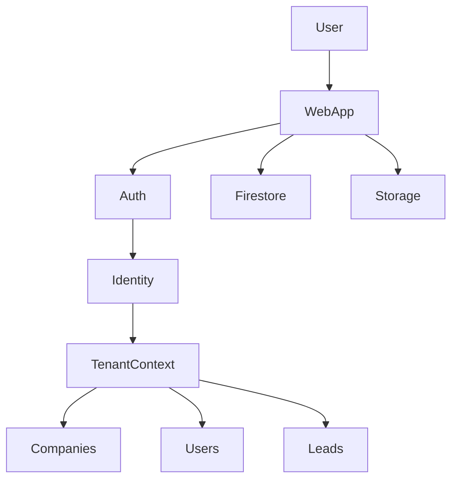
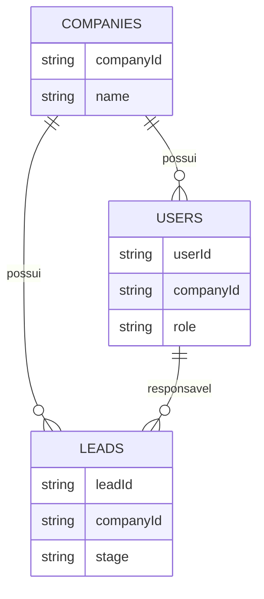

# 🚀 Web App CRM — Backend


Backend do **Web App CRM**, um sistema **SaaS multiempresa** para gestão de leads, clientes e equipes comerciais.

---

# 📌 Visão Geral

CRM SaaS multiempresa com isolamento lógico de dados por empresa.

Funcionalidades:
- Gestão de empresas (tenants)
- Gestão de usuários e permissões
- Pipeline de vendas em Kanban
- Dashboard comercial
- Gestão de equipes

---

# 🧠 Arquitetura SaaS



➡️ [Architecture Documentation](docs/architecture.md)

---

# 🗂 Modelagem de Dados



➡️ [Data Model Documentation](docs/data-model.md)

---

# 🔐 Segurança

- Firebase Authentication
- Firestore Security Rules
- RBAC
- Isolamento multi-tenant

➡️ [Security Documentation](docs/security.md)

---

# 🚀 Deploy

Pré‑requisitos:

- Node.js
- Firebase CLI

Instalação:

```bash
npm install -g firebase-tools
```

Login:

```bash
firebase login
```

Deploy:

```bash
firebase deploy
```

Deploy específico:

```bash
firebase deploy --only firestore
firebase deploy --only storage
```

---

# 📁 Estrutura

```
web-app-crm-backend
│
├─ docs
│  ├─ architecture.md
│  ├─ data-model.md
│  └─ security.md│
├─ environments
│  ├─ dev
│  └─ prod
├─ firebase
│  ├─ cors
│  ├─ firestore
│  └─ storage
├─ firebase.json
├─ README.md
└─ CHANGELOG.md
```

---

# 👨‍💻 Autor

Léo Moraes
